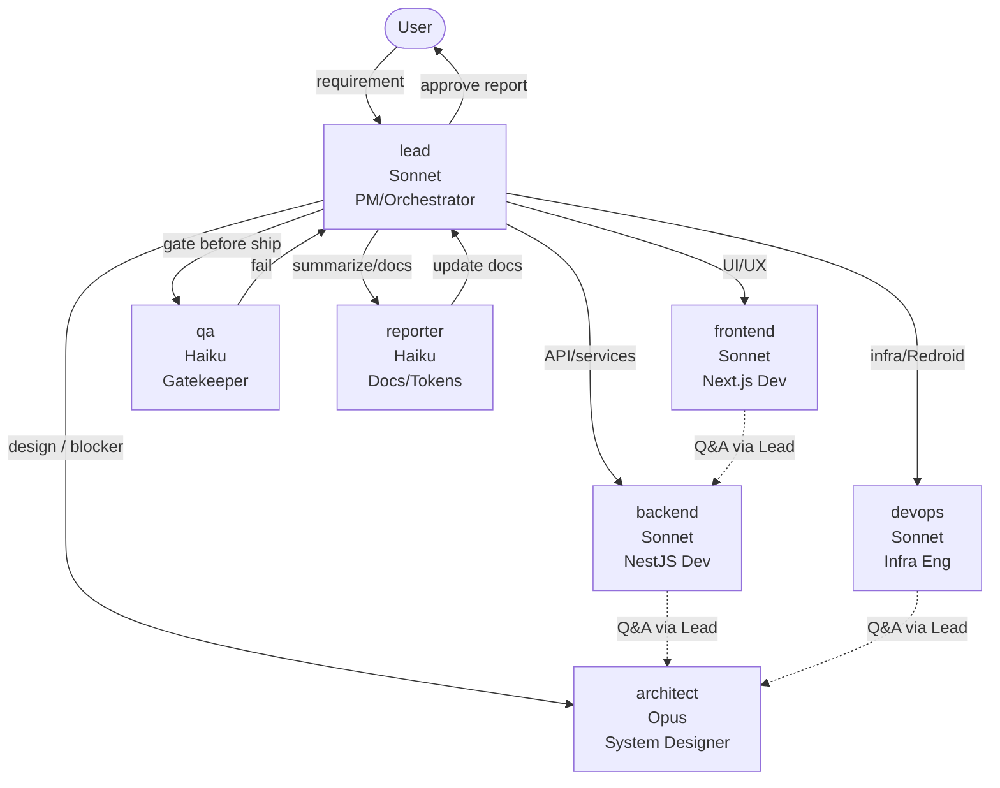

# AGENTS.md — EmulFast AI Agent Map

ระบบ AI multi-agent สำหรับพัฒนา EmulFast บน Claude Code (CLI). อ่านไฟล์นี้คู่กับ `CLAUDE.md` และ definition แต่ละตัวใน `.claude/agents/`

## ภาพรวม



## Agent Roster

| Agent | Model | Cost Tier | บทบาท | เมื่อใช้ |
|---|---|---|---|---|
| **lead** | Sonnet | $$ | PM/Orchestrator — จุดเข้า-ออกเดียว | ทุก request ของ User |
| **architect** | Opus | $$$ | System Design + Schema + API Contract | Phase 0 / blocker / refactor ใหญ่ |
| **backend** | Sonnet | $$ | NestJS API + Prisma + BullMQ | feature backend |
| **frontend** | Sonnet | $$ | Next.js + UI + i18n | feature frontend |
| **devops** | Sonnet | $$ | Docker + Redroid + Nginx + CI | infra ทุกอย่าง |
| **qa** | Haiku | $ | Lint + Typecheck + Test | gate ก่อนส่ง User |
| **reporter** | Haiku | $ | docs + token tracker | จบทุก handoff |

> Cost tier โดยประมาณ: $ = Haiku, $$ = Sonnet (~5x ของ Haiku), $$$ = Opus (~5x ของ Sonnet)

## หลักการมอบหมาย (Decision Tree)

```
User request
   │
   ▼
[lead รับงาน]
   │
   ├─ เป็น design / schema ใหม่ ────────────► architect
   ├─ เป็น API / service / queue ──────────► backend
   ├─ เป็น page / component / UI ──────────► frontend
   ├─ เป็น Docker / Redroid / Nginx ───────► devops
   ├─ ก่อนส่ง User (ทุก task) ─────────────► qa (gate)
   └─ จบ task / phase ─────────────────────► reporter (สรุป + token)
```

## Communication Rules

### 1. ทุกอย่างผ่าน Lead

- User ส่ง requirement → **lead** เท่านั้น
- ห้าม subagent แตะ User โดยตรง
- Lead delegate ผ่าน `Task` tool เสมอ (ไม่ inline ขอความช่วยเหลือ)

### 2. Sub-agent ↔ Sub-agent ห้ามคุยตรง

- backend ติด API design ที่ frontend ใช้ → แจ้ง lead → lead ขอ architect ปรับ contract → lead แจ้ง backend + frontend
- frontend ใช้ endpoint ที่ backend ยังไม่ทำ → แจ้ง lead → lead ส่ง backend ทำเพิ่ม

> เหตุผล: ลด context bleed, รักษา audit trail, เลี่ยง infinite loop ของ delegation

### 3. Escalation

| สถานการณ์ | ทำอะไร |
|---|---|
| Sub-agent ติดงานที่ scope ของตัวเอง | รายงาน lead, lead ส่งกลับพร้อม hint |
| Sub-agent ติด design issue | lead → architect → ตอบกลับ lead → lead ส่ง subagent |
| QA fail | qa รายงาน lead, lead ระบุ owner, ส่งกลับแก้ |
| เกินขอบเขต User กำหนด | **หยุดทันที** — lead ถาม User ก่อน |
| เกิน token budget 80% ของ phase | reporter เตือน lead → lead แจ้ง User |

## QA Gate (บังคับ)

ก่อน lead ส่งงานให้ User **ทุกครั้ง**:

```
1. lead เรียก qa
2. qa รัน: pnpm lint && pnpm typecheck && pnpm test
3. ถ้า PASS → lead เรียก reporter อัปเดต docs
4. ถ้า FAIL → lead ส่งกลับ owner agent แก้, ทำ loop จนผ่าน
```

ห้าม "ข้าม" หรือ "marker as TODO" — ถ้าผ่านไม่ได้จริง ๆ ให้ lead แจ้ง User ตัดสินใจ

## Token-Saving Strategy

1. **ใช้ Haiku สำหรับงานซ้ำ**: qa + reporter (ลด cost ~80% เทียบ Sonnet)
2. **ใช้ Opus เฉพาะตอน design ใหม่**: architect เรียก ~3-5 ครั้งทั้งโปรเจกต์
3. **Subagent isolation**: subagent มี context window ของตัวเอง → lead ไม่ต้องแบกทุกอย่าง
4. **Selective reading**: ทุก agent ใช้ `Glob`+`Grep` ก่อน `Read`
5. **Single source of truth**: `docs/api-contract.md` แทนการ re-explain
6. **Phase gating**: ทำเสร็จ phase ก่อนค่อยขึ้นถัดไป (กัน rework)

## Tool Permissions (สรุป — รายละเอียดใน `.claude/settings.local.json`)

| Agent | Read | Write | Edit | Bash | Task | Glob/Grep |
|---|---|---|---|---|---|---|
| lead | ✅ | docs/ | docs/ | script helpers only | ✅ | ✅ |
| architect | ✅ | docs/, schema | docs/, schema | ❌ | ❌ | ✅ |
| backend | ✅ | apps/api, packages/shared | same | pnpm/test | ❌ | ✅ |
| frontend | ✅ | apps/web, packages/ui | same | pnpm/build | ❌ | ✅ |
| devops | ✅ | infra/, apps/orchestrator | same | docker/pnpm | ❌ | ✅ |
| qa | ✅ | ❌ | ❌ | lint/test only | ❌ | ✅ |
| reporter | ✅ | docs/ | docs/ | ❌ | ❌ | ✅ |

## Custom Slash Commands

ดูใน `.claude/commands/`:

- **`/plan-phase <N>`** — เริ่ม phase ใหม่ (lead วิเคราะห์ + แตก task)
- **`/handoff <from>-><to>`** — ส่งงานข้าม agent (lead เป็นผู้ดำเนินการ)
- **`/token-report`** — reporter รายงาน token cost ปัจจุบัน
- **`/ship`** — รัน QA gate + reporter + ส่ง User approve
- **`/research <question>`** — lead เรียก DeepSeek CLI ทำ research แล้วกลับมาถาม User
- **`/debug-log <path>`** — lead/qa ส่ง log ไป GPT CLI เพื่อ triage root cause

## ตัวอย่าง Flow: Phase 2 Task — "เพิ่มชำระเงินผ่าน PromptPay"

```
User: /plan-phase 2
   │
   ▼
lead: วิเคราะห์ scope, แตก subtask (5 tasks)
   │  TodoWrite → [...5 todos]
   │
   ▼ (Task #1: schema)
architect: เพิ่ม Payment.gateway = 'omise', PaymentMethod enum
   │  → packages/db/prisma/schema.prisma
   │
   ▼ (Task #2: API)
backend: PaymentModule, OmiseService, webhook handler
   │  → apps/api/src/modules/payment/
   │
   ▼ (Task #3: UI)
frontend: หน้าชำระเงิน + QR display + polling status
   │  → apps/web/src/app/[locale]/(user)/checkout/
   │
   ▼ (Task #4: Gate)
qa: pnpm lint + typecheck + test → ✅ PASS
   │
   ▼ (Task #5: Report)
reporter: อัปเดต docs/phases.md + docs/token-budget.md
   │
   ▼
lead → User: "ทำเสร็จ 5/5 subtasks, token ใช้ ~85k, รอ approve"
```

---

> เมื่อมีข้อสงสัย: อ่าน definition ของ agent นั้น ๆ ใน `.claude/agents/<name>.md`
