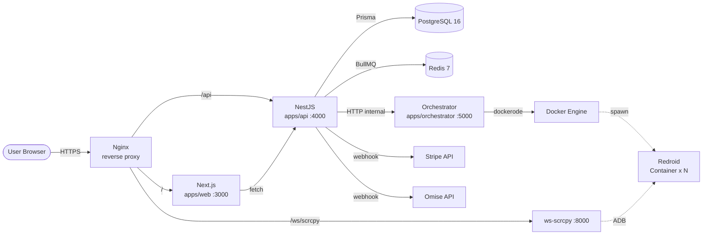
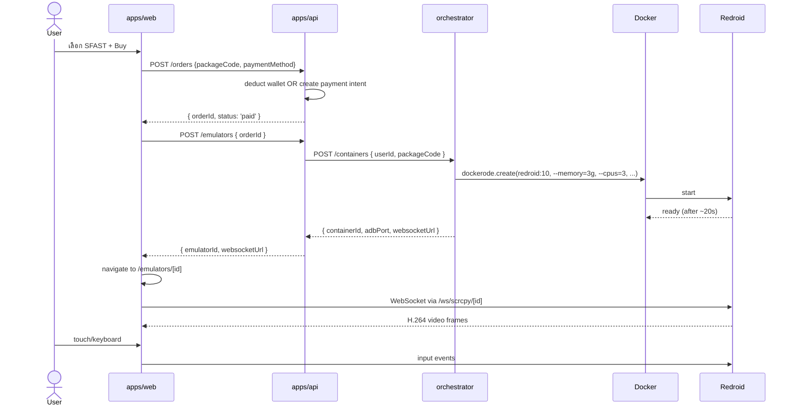
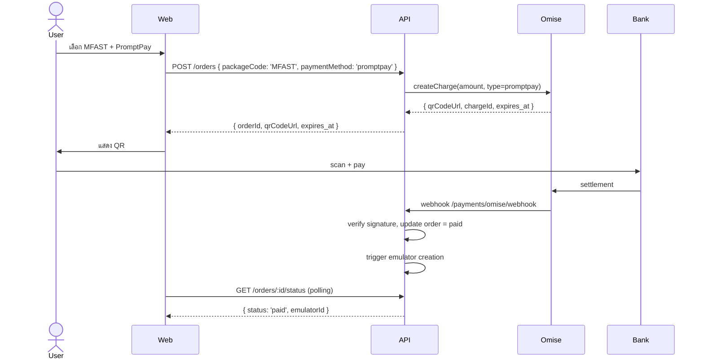
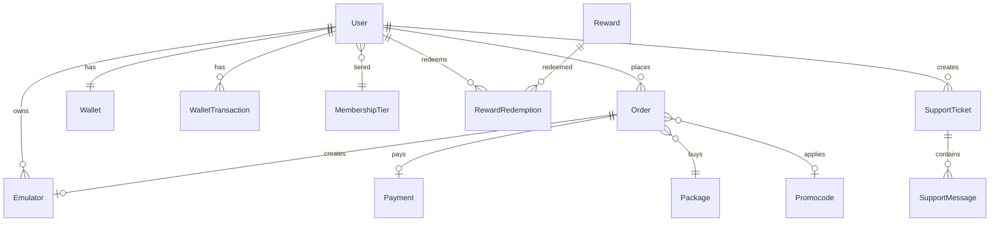

# EmulFast — Architecture

> Source of truth สำหรับ system design. **เฉพาะ `architect` agent อัปเดตได้** (lead สั่ง)

## ภาพรวมระบบ

## Service Boundaries

### `apps/web` — Next.js 15 (App Router)
- Public + authenticated user pages + admin dashboard (route group)
- i18n (TH/EN) ผ่าน `next-intl` middleware
- Server components default; client components เฉพาะ interactive (forms, viewer, charts)
- ใช้ shadcn/ui + Tailwind

### `apps/api` — NestJS 11
- REST endpoints + WebSocket gateway
- Modules: Auth, User, Package, Emulator, Order, Payment, Wallet, Promocode, Membership, Reward, Support, Feedback, Admin
- Validation ด้วย zod ผ่าน `ZodValidationPipe`
- Auth: JWT (access 15min) + Refresh token (7 days, httpOnly cookie)
- Background jobs: BullMQ (renewal scan, payment retry, support FAQ index)

### `apps/orchestrator` — NestJS microservice
- เรียก Docker API ผ่าน `dockerode` socket
- Internal API only (network policy block external)
- Endpoints: `/containers` (CRUD), `/health`
- Token-protected (`ORCHESTRATOR_TOKEN`)

### `packages/db` — Prisma
- `schema.prisma` (single source of truth สำหรับ data model)
- Migrations + seed
- Generated client export ผ่าน `@emulfast/db`

### `packages/shared` — TypeScript types + zod schemas
- ใช้ทั้ง api + web (validation symmetric)
- DTO definitions, enum constants, error codes, i18n keys

### `packages/ui` — Shared React components
- shadcn primitives ที่ extend แล้ว
- ใช้ใน `apps/web` (อาจไม่จำเป็นสำหรับ Demo — รวมใน apps/web/components ก็ได้)

## Data Flow ตัวอย่าง

### สร้าง Emulator (Phase 1)

### ชำระเงินผ่าน PromptPay (Phase 2)

## Data Model (สรุป — schema เต็มอยู่ใน Phase 0)

ตารางหลัก: `User`, `Package`, `Emulator`, `Order`, `Payment`, `Wallet`, `WalletTransaction`, `Promocode`, `MembershipTier`, `Reward`, `RewardRedemption`, `SupportTicket`, `SupportMessage`, `Feedback`

## Security

- **Auth**: JWT access (15min) + Refresh (httpOnly + Secure + SameSite=Lax cookie)
- **RBAC**: roles `user | staff | admin` enforced ผ่าน `RolesGuard`
- **CSRF**: double-submit cookie pattern
- **Rate limit**: `@nestjs/throttler` + Redis store (10 req/sec/IP global, stricter ที่ /auth/*)
- **Input**: zod validation, SQL via Prisma (no raw)
- **Money**: Decimal everywhere, transaction-wrapped ทุก wallet operation
- **Webhook**: HMAC signature verify (Stripe + Omise)
- **Container isolation**: Redroid containers แยก network, no egress ไป internal services
- **Secrets**: ผ่าน env vars only, ไม่ commit เข้า git

## Deployment (Demo)

- **Host**: Ubuntu 22.04+ VPS (4 vCPU, 16GB RAM, 200GB SSD ขั้นต่ำ — รองรับ 2-4 emulator พร้อมกัน)
- **KVM**: ต้อง enabled (`/dev/kvm` accessible)
- **Docker**: 24+, docker compose v2
- **Reverse proxy**: Nginx + Let's Encrypt
- **DB backup**: cron `pg_dump` รายวัน → store local + S3 (optional)

## Performance Targets (Demo)

- Boot Redroid → ready: ≤ 30s
- WebSocket latency (input → frame): ≤ 250ms (LAN test)
- API p95 latency: ≤ 200ms (ยกเว้น webhook + emulator create)
- Concurrent emulators per host: 4 (Demo) — 8+ ในอนาคต

## ADRs

ดู `docs/adr/` (architect เพิ่มเมื่อมี decision สำคัญ)

_(ยังไม่มี ADR ใน skeleton นี้ — architect จะสร้างใน Phase 0)_
